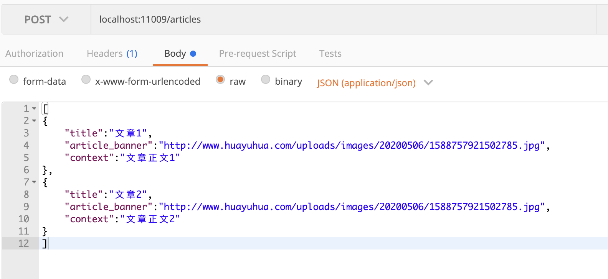
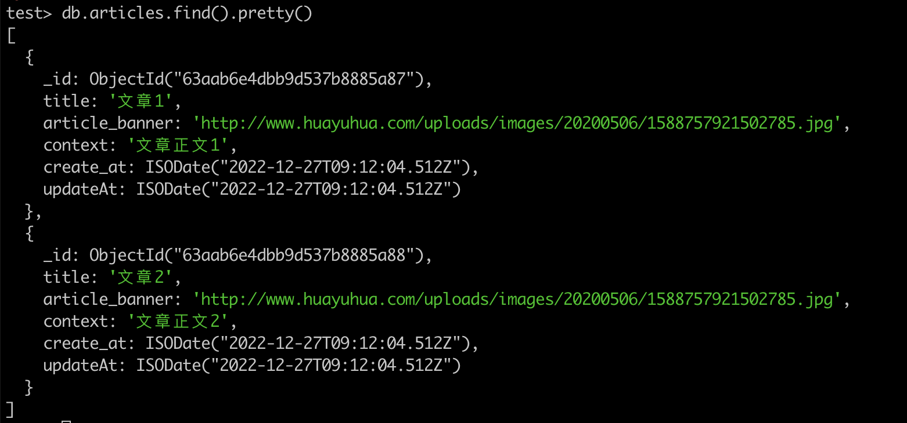
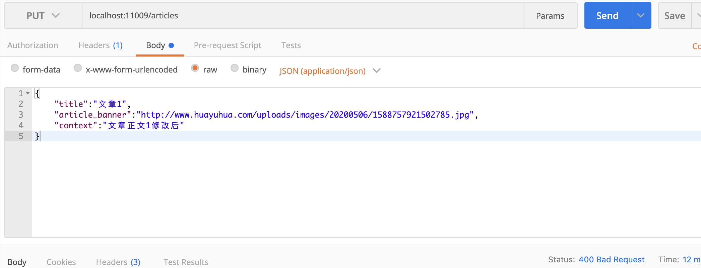
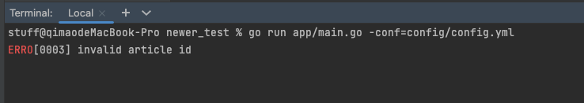
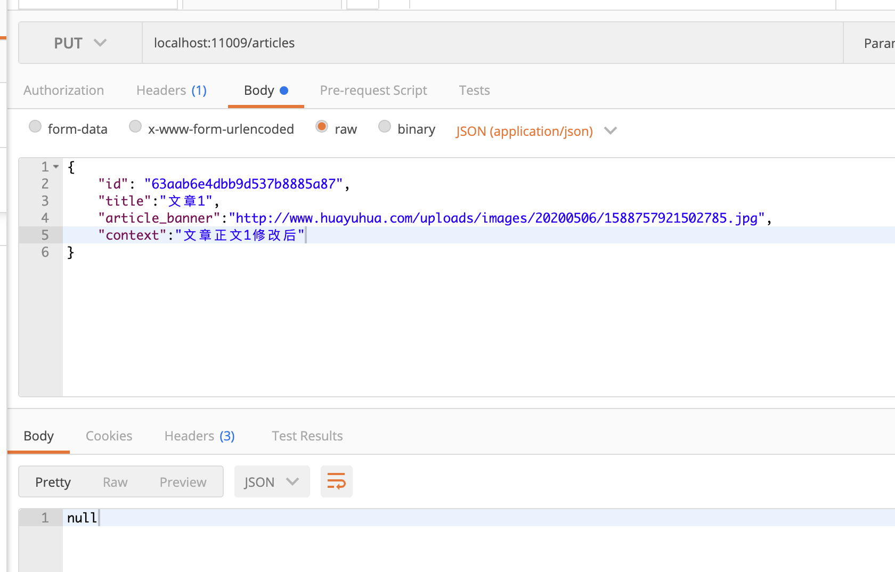
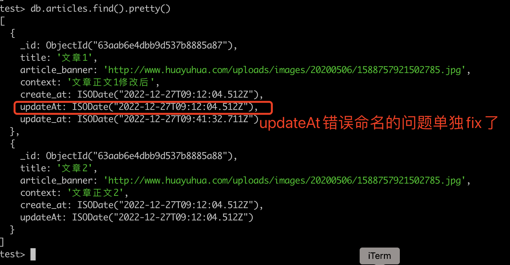
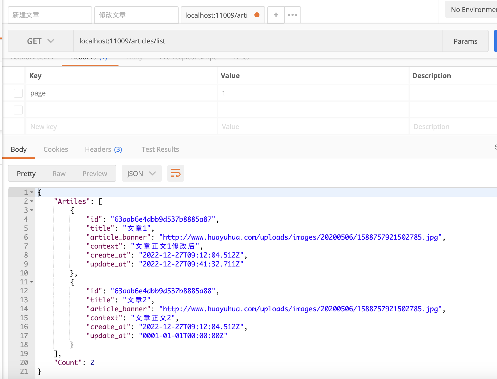
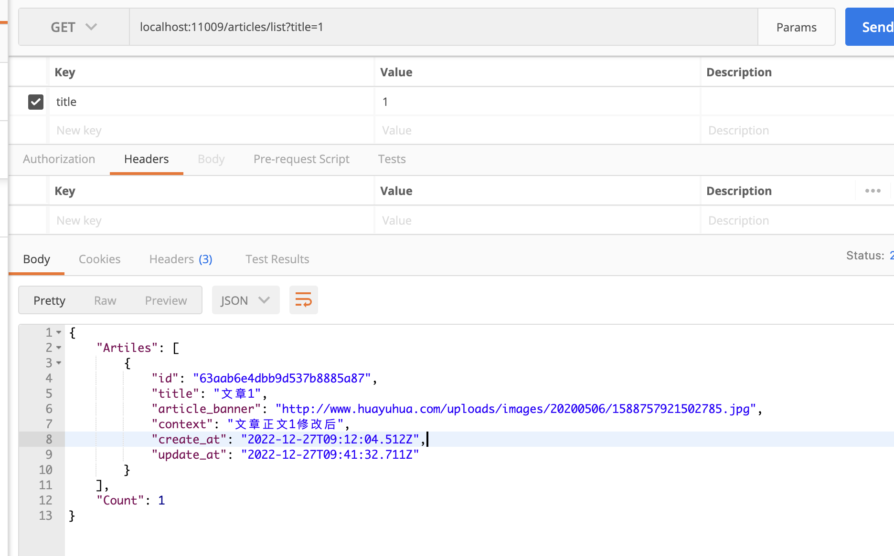
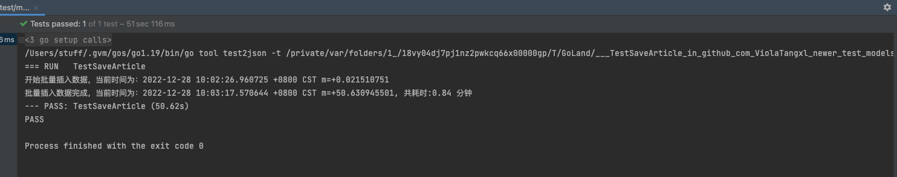
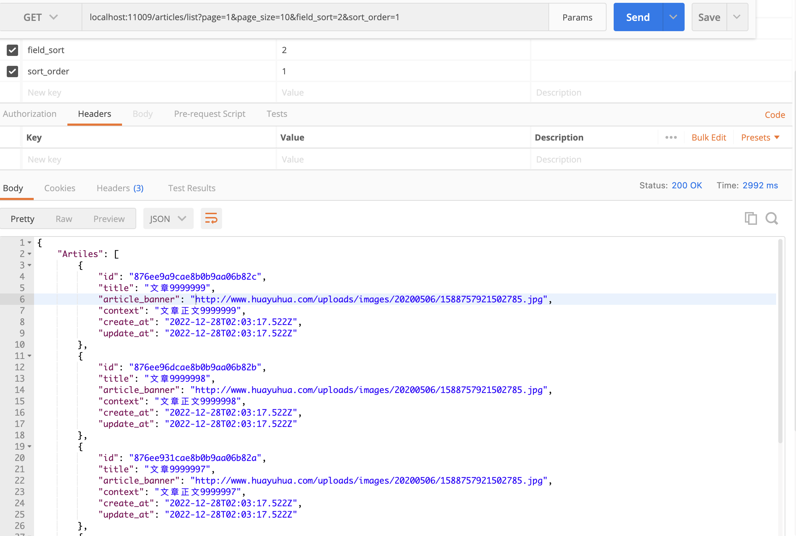

## 新人训练

### 题目要求
使用gin框架开发文章管理服务的前端接口，至少包括以下字段：文章标题、图片、内容。书写架构设计思路，如何承接千万级的qps。
要求：日活1000万，峰值QPS：10000。文章数量有1千万条。
存储：设计自定义。

接口：
1、文章列表接口，支持排序、分页
2、文章添加接口
3、文章编辑接口

### 系统选型及中间件
#### 存储
考虑到文章可能因来源、类别等不同，文章字段格式与内容大有不同(本次需求中暂未体现)，且数据量较大，使用`mongo`存储文章数据。

#### 缓存
* 由于文章数据量较大，且认为查询需求高于增改需求，大流量情况下，不可能每次都从 `mongo` 实时获取文章信息，因此考虑引入缓存。

主流的缓存 `Redis` 可以满足需求，因此选用`Redis`作为缓存中间件

#### 系统框架
根据要求选取`gin`框架进行开发

#### 搜索引擎
如果搜索条件较多，考虑是否接入ES进行文章搜索？

### 备注
#### 图片
* 考虑到图片字段，假设文章中图片的大小在录入时有限制，不会出现大图(16M以上)的情况，所以单独不使用 `gridfs`
* 单独的图片字段，假设业务中每篇文章有个默认图片的场景，非文章正文中出现的插图。为方便理解，称为头图
* 如果是文章正文中的插图，前端编辑文章时可以使用上传插件，后端文章正文字段中直接存储`bucket`的`url`？

### 自测过程
#### TODO 单测
#### 小数据量新建文章 
POST localhost:11009/articles

#### 小数据量新建文章
PUT localhost:11009/articles
* 没有带`id`字段

* 正确修改

#### 小数据量分页查询文章
GET localhost:11009/articles/list
* 全部查询，默认10条
  

* 标题模糊查询
  

#### 批量插入1000W数据单测

#### 分页接口排序

